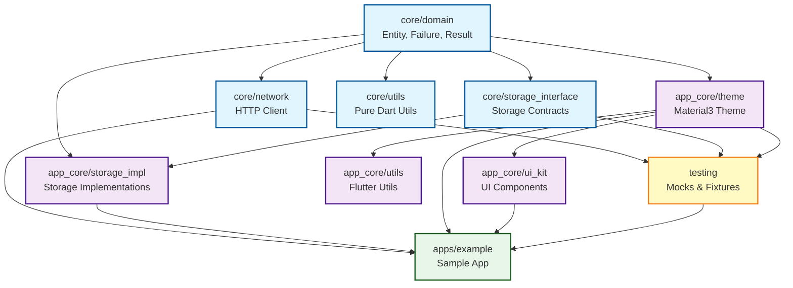

# Tiny Tree App Template - Packages 구현 계획

## 📋 프로젝트 개요

Tiny Tree App Template의 모노레포 패키지 구조를 완성하는 계획입니다. 현재 `packages/core/domain`만 구현되어 있으며, 나머지 필수 패키지들을 단계적으로 구현합니다.

### 현재 상태

- ✅ `packages/core/domain` - 완전 구현 (Result, Failure, Entity, UseCase, ValueObject)
- ❌ `packages/core/network`, `storage`, `utils` - 미구현
- ❌ `packages/app_core/*` - 전체 디렉토리 미생성
- ❌ `packages/testing` - 미구현

### 목표

- 9개 Phase로 나누어 모든 필수 패키지 구현
- 각 Phase는 별도 브랜치에서 2시간 이내 완료
- 모든 패키지에 테스트 코드 필수 포함 (최소 80% 커버리지)
- CLAUDE.md의 아키텍처 원칙 엄격히 준수

---

## 🎯 Phase 0: Failure 타입 사전 정의

### 브랜치

```bash
git checkout -b feat/domain-failure-types
```

### 작업 내용

#### 1. StorageFailure 추가

```bash
cd packages/core/domain
```

#### 2. lib/src/failure/failure.dart 수정

기존 파일에 StorageFailure 추가:

```dart
/// Storage operation failures (file, cache, preferences, secure storage)
final class StorageFailure extends Failure {
  const StorageFailure(super.message, {this.key, this.operation});

  /// The storage key that failed (optional)
  final String? key;

  /// The operation type (read, write, delete, clear)
  final String? operation;

  @override
  List<Object?> get props => <Object?>[message, key, operation];
}
```

#### 3. test/failure/failure_test.dart에 테스트 추가

```dart
group('StorageFailure', () {
  test('creates instance with message only', () {
    const failure = StorageFailure('Storage error');
    expect(failure.message, 'Storage error');
    expect(failure.key, isNull);
    expect(failure.operation, isNull);
  });

  test('creates instance with key and operation', () {
    const failure = StorageFailure(
      'Failed to read',
      key: 'user_token',
      operation: 'read',
    );
    expect(failure.key, 'user_token');
    expect(failure.operation, 'read');
  });

  test('equatable works correctly', () {
    const failure1 = StorageFailure('msg', key: 'k1');
    const failure2 = StorageFailure('msg', key: 'k1');
    const failure3 = StorageFailure('msg', key: 'k2');

    expect(failure1, equals(failure2));
    expect(failure1, isNot(equals(failure3)));
  });

  test('includes key and operation in props', () {
    const failure = StorageFailure('msg', key: 'k', operation: 'write');
    expect(failure.props, contains('msg'));
    expect(failure.props, contains('k'));
    expect(failure.props, contains('write'));
  });
});
```

### 검증

```bash
cd packages/core/domain
dart analyze
dart test
```

### 예상 소요 시간: 30분

- Failure 클래스 추가: 10분
- 테스트 작성: 15분
- 검증 및 PR: 5분

---

## 🎯 Phase 1: packages/core/network

### 브랜치

```bash
git checkout -b feat/package-core-network
```

### 작업 내용

#### 1. 패키지 생성

```bash
cd packages/core
dart create network
cd network
```

#### 2. pubspec.yaml

```yaml
name: network
description: HTTP client wrapper with Result pattern integration
version: 0.1.0
publish_to: none
resolution: workspace

environment:
  sdk: ^3.10.0

dependencies:
  domain:
    path: ../domain
  dio: ^5.7.0

dev_dependencies:
  lints: ^6.0.0
  test: ^1.25.6
  mockito: ^5.4.4
  build_runner: ^2.4.13
```

#### 3. analysis_options.yaml

```yaml
include: ../../../analysis_options.yaml
```

#### 4. 디렉토리 구조

```text
lib/
├── network.dart (배럴 파일)
└── src/
    ├── client/
    │   ├── api_client.dart
    │   └── api_client_config.dart
    ├── interceptor/
    │   ├── logging_interceptor.dart
    │   └── error_interceptor.dart
    ├── exception/
    │   └── network_exception.dart
    └── mapper/
        └── failure_mapper.dart
```

#### 5. 핵심 구현 사항

- **ApiClient**: Dio 래핑, Result 패턴 반환
  - `Future<Result<NetworkFailure, T>> get<T>(String path)`
  - `Future<Result<NetworkFailure, T>> post<T>(String path, dynamic data)`
  - `Future<Result<NetworkFailure, T>> put<T>(String path, dynamic data)`
  - `Future<Result<NetworkFailure, T>> delete<T>(String path)`
- **FailureMapper**: DioException → NetworkFailure 변환
- **ErrorInterceptor**: 자동 에러 처리

#### 6. 테스트

```text
test/
├── client/api_client_test.dart
├── interceptor/error_interceptor_test.dart
└── mapper/failure_mapper_test.dart
```

#### 7. 루트 pubspec.yaml 업데이트

```yaml
workspace:
  - packages/core/domain
  - packages/core/network  # 추가
```

### 검증

```bash
cd packages/core/network
dart analyze
dart test
cd ../../..
melos bootstrap
```

### 예상 소요 시간: 2시간

- 패키지 생성 및 설정: 15분
- ApiClient 구현: 45분
- Interceptor 및 Mapper: 30분
- 테스트 작성: 30분

---

## 🎯 Phase 2: packages/core/storage_interface + utils

### 브랜치

```bash
git checkout -b feat/package-core-storage-utils
```

### 작업 내용

#### packages/core/storage_interface (인터페이스만)

##### 1. 패키지 생성

```bash
cd packages/core
dart create storage_interface
cd storage_interface
```

##### 2. pubspec.yaml

```yaml
name: storage_interface
description: Storage interfaces for TinyTree
version: 0.1.0
publish_to: none
resolution: workspace

environment:
  sdk: ^3.10.0

dependencies:
  domain:
    path: ../domain

dev_dependencies:
  lints: ^6.0.0
  test: ^1.25.6
```

##### 3. 구조

```text
lib/
├── storage_interface.dart (배럴 파일)
└── src/
    ├── i_storage.dart
    └── i_secure_storage.dart
```

##### 4. 핵심 인터페이스

```dart
abstract class IStorage {
  Future<Result<StorageFailure, void>> saveString(String key, String value);
  Future<Result<StorageFailure, String?>> getString(String key);
  Future<Result<StorageFailure, void>> saveInt(String key, int value);
  Future<Result<StorageFailure, int?>> getInt(String key);
  Future<Result<StorageFailure, void>> saveBool(String key, bool value);
  Future<Result<StorageFailure, bool?>> getBool(String key);
  Future<Result<StorageFailure, void>> remove(String key);
  Future<Result<StorageFailure, void>> clear();
}

abstract class ISecureStorage {
  Future<Result<StorageFailure, void>> write(String key, String value);
  Future<Result<StorageFailure, String?>> read(String key);
  Future<Result<StorageFailure, void>> delete(String key);
  Future<Result<StorageFailure, void>> deleteAll();
}
```

**참고**: StorageFailure는 Phase 0에서 이미 domain 패키지에 추가되었습니다.

#### packages/core/utils (순수 Dart 유틸리티)

##### 1. 패키지 생성

```bash
cd packages/core
dart create utils
cd utils
```

##### 2. pubspec.yaml

```yaml
name: utils
description: Pure Dart utilities
version: 0.1.0
publish_to: none
resolution: workspace

environment:
  sdk: ^3.10.0

dependencies:
  intl: ^0.20.1

dev_dependencies:
  lints: ^6.0.0
  test: ^1.25.6
```

##### 3. 구조

```text
lib/
├── utils.dart
└── src/
    ├── string_utils.dart
    ├── date_utils.dart
    ├── number_utils.dart
    └── validation_utils.dart
```

##### 4. 핵심 유틸리티

- **StringUtils**: `isNullOrEmpty`, `capitalize`, `truncate`
- **DateUtils**: `formatDate`, `parseIso8601`, `daysBetween`
- **NumberUtils**: `formatCurrency`, `roundTo`, `toPercentage`
- **ValidationUtils**: `isValidEmail`, `isValidPhone`, `isValidUrl`

### 검증

```bash
cd packages/core/storage && dart analyze && dart test
cd ../utils && dart analyze && dart test
cd ../../..
melos bootstrap
```

### 예상 소요 시간: 2시간

- storage 인터페이스: 30분
- utils 구현: 60분
- 테스트: 30분

---

## 🎯 Phase 3: packages/app_core/theme

### 브랜치

```bash
git checkout -b feat/package-app-core-theme
```

### 작업 내용

#### 1. app_core 디렉토리 생성

```bash
mkdir -p packages/app_core
cd packages/app_core
flutter create --template=package theme
cd theme
```

#### 2. pubspec.yaml

```yaml
name: theme
description: Material3 theme for TinyTree apps
version: 0.1.0
publish_to: none
resolution: workspace

environment:
  sdk: ^3.10.0
  flutter: ">=3.38.0"

dependencies:
  flutter:
    sdk: flutter

dev_dependencies:
  flutter_test:
    sdk: flutter
  flutter_lints: ^7.0.0
```

#### 3. analysis_options.yaml

```yaml
include: ../../../analysis_options.yaml
```

#### 4. 구조

```text
lib/
├── theme.dart
└── src/
    ├── colors/
    │   ├── app_colors.dart
    │   └── color_schemes.dart
    ├── typography/
    │   ├── app_text_styles.dart
    │   └── app_fonts.dart
    ├── theme/
    │   ├── app_theme.dart
    │   ├── light_theme.dart
    │   └── dark_theme.dart
    └── constants/
        └── spacing.dart
```

#### 5. 핵심 구현

- **AppColors**: Material3 색상 팔레트
- **ColorSchemes**: Light/Dark ColorScheme
- **AppTextStyles**: Display, Headline, Body, Label
- **AppTheme**: `light()`, `dark()` ThemeData 생성
- **Spacing**: xs(4), sm(8), md(16), lg(24), xl(32), xxl(48)

#### 6. Material3 적용

```dart
ThemeData(
  useMaterial3: true,
  colorScheme: ColorScheme.light(...),
  textTheme: TextTheme(...),
)
```

### 검증

```bash
cd packages/app_core/theme
flutter analyze
flutter test
cd ../../..
melos bootstrap
```

### 예상 소요 시간: 2시간

- 색상 정의: 30분
- Typography: 30분
- ThemeData 구성: 30분
- 테스트: 30분

---

## 🎯 Phase 4: packages/app_core/ui_kit

### 브랜치

```bash
git checkout -b feat/package-app-core-ui-kit
```

### 작업 내용

#### 1. 패키지 생성

```bash
cd packages/app_core
flutter create --template=package ui_kit
cd ui_kit
```

#### 2. pubspec.yaml

```yaml
name: ui_kit
description: Reusable UI components
version: 0.1.0
publish_to: none
resolution: workspace

environment:
  sdk: ^3.10.0
  flutter: ">=3.38.0"

dependencies:
  flutter:
    sdk: flutter
  theme:
    path: ../theme

dev_dependencies:
  flutter_test:
    sdk: flutter
  flutter_lints: ^7.0.0
```

#### 3. 구조

```text
lib/
├── ui_kit.dart
└── src/
    ├── buttons/
    │   ├── primary_button.dart
    │   ├── secondary_button.dart
    │   └── text_button.dart
    ├── cards/
    │   ├── app_card.dart
    │   └── list_tile_card.dart
    ├── dialogs/
    │   ├── alert_dialog.dart
    │   └── confirmation_dialog.dart
    ├── inputs/
    │   ├── app_text_field.dart
    │   └── search_field.dart
    └── loading/
        ├── loading_indicator.dart
        └── shimmer_loading.dart
```

#### 4. 핵심 위젯

- **PrimaryButton**: FilledButton 기반
- **SecondaryButton**: OutlinedButton 기반
- **AppCard**: Material3 카드
- **AppAlertDialog**: 커스텀 다이얼로그
- **AppTextField**: 검증 지원
- **LoadingIndicator**: 로딩 표시

### 검증

```bash
cd packages/app_core/ui_kit
flutter analyze
flutter test
cd ../../..
melos bootstrap
```

### 예상 소요 시간: 2시간

- Buttons: 30분
- Cards: 20분
- Dialogs: 30분
- Inputs: 20분
- Loading: 10분
- 테스트: 30분

---

## 🎯 Phase 5: packages/app_core/storage_impl + utils

### 브랜치

```bash
git checkout -b feat/package-app-core-storage-utils
```

### 작업 내용

#### packages/app_core/storage_impl (구현체)

##### 1. 패키지 생성

```bash
cd packages/app_core
flutter create --template=package storage_impl
cd storage_impl
```

##### 2. pubspec.yaml

```yaml
name: storage_impl
description: Storage implementations for Flutter
version: 0.1.0
publish_to: none
resolution: workspace

environment:
  sdk: ^3.10.0
  flutter: ">=3.38.0"

dependencies:
  flutter:
    sdk: flutter
  domain:
    path: ../../core/domain
  storage_interface:
    path: ../../core/storage_interface
  shared_preferences: ^2.3.4
  flutter_secure_storage: ^9.2.2

dev_dependencies:
  flutter_test:
    sdk: flutter
  flutter_lints: ^7.0.0
  mockito: ^5.4.4
```

##### 3. 구조

```text
lib/
├── storage_impl.dart (배럴 파일)
└── src/
    ├── shared_prefs_storage.dart
    ├── secure_storage_impl.dart
    └── storage_keys.dart
```

##### 4. 핵심 구현

- **SharedPrefsStorage implements IStorage**
- **SecureStorageImpl implements ISecureStorage**
- Result 패턴으로 모든 메서드 구현

##### 5. 플랫폼별 제약사항 및 구현 세부사항

###### iOS

- **구현체**: Keychain Services
- **제약사항**:
  - 앱 삭제 시 데이터 유지 여부 설정 가능 (`kSecAttrAccessible`)
  - Simulator에서 Keychain 동작이 실제 기기와 다를 수 있음
  - Face ID/Touch ID 인증 연동 가능

###### Android

- **구현체**: EncryptedSharedPreferences
- **최소 버전**: API 23 (Android 6.0 Marshmallow)
- **제약사항**:
  - Android Keystore 사용
  - 앱 삭제 시 데이터 자동 삭제
  - 루팅된 기기에서 보안 약화 가능성

###### Web

- **지원 여부**: ❌ **미지원**
- **이유**: flutter_secure_storage는 Web을 지원하지 않음
- **대안**:
  - 중요하지 않은 데이터: localStorage (SharedPreferences)
  - 중요 데이터: 서버 세션 기반 인증 권장
  - 암호화 필요 시: 별도 라이브러리 (crypto, pointycastle) + localStorage

###### Desktop (Linux/macOS/Windows)

- **구현체**:
  - Linux: Secret Service API (libsecret)
  - macOS: Keychain
  - Windows: Credential Manager
- **제약사항**: 플랫폼별 설정 필요

###### 코드 예시: 플랫폼 체크

```dart
import 'package:flutter/foundation.dart' show kIsWeb;

class SecureStorageImpl implements ISecureStorage {
  SecureStorageImpl() {
    if (kIsWeb) {
      throw UnsupportedError(
        'SecureStorage is not supported on Web platform. '
        'Use server-side session or encrypted localStorage instead.',
      );
    }
  }

  // ... 구현 ...
}
```

#### packages/app_core/utils (Flutter 유틸리티)

##### 1. 패키지 생성

```bash
cd packages/app_core
flutter create --template=package utils
cd utils
```

##### 2. pubspec.yaml

```yaml
name: utils
description: Flutter utility functions
version: 0.1.0
publish_to: none
resolution: workspace

environment:
  sdk: ^3.10.0
  flutter: ">=3.38.0"

dependencies:
  flutter:
    sdk: flutter

dev_dependencies:
  flutter_test:
    sdk: flutter
  flutter_lints: ^7.0.0
```

##### 3. 구조

```text
lib/
├── utils.dart
└── src/
    ├── context_extensions.dart
    ├── widget_utils.dart
    ├── responsive_utils.dart
    └── snackbar_utils.dart
```

##### 4. 핵심 기능

- **ContextExtensions**: `context.theme`, `context.mediaQuery`
- **ResponsiveUtils**: `isMobile`, `isTablet`, `isDesktop`
- **SnackbarUtils**: `showSuccessSnackbar`, `showErrorSnackbar`

### 검증

```bash
cd packages/app_core/storage && flutter analyze && flutter test
cd ../utils && flutter analyze && flutter test
cd ../../..
melos bootstrap
```

### 예상 소요 시간: 2시간

- storage 구현: 60분
- utils 구현: 30분
- 테스트: 30분

---

## 🎯 Phase 6: packages/testing

### 브랜치

```bash
git checkout -b feat/package-testing
```

### 작업 내용

#### 1. 패키지 생성

```bash
cd packages
flutter create --template=package testing
cd testing
```

#### 2. pubspec.yaml

```yaml
name: testing
description: Testing utilities and mocks
version: 0.1.0
publish_to: none
resolution: workspace

environment:
  sdk: ^3.10.0
  flutter: ">=3.38.0"

dependencies:
  flutter:
    sdk: flutter
  domain:
    path: ../core/domain
  network:
    path: ../core/network
  storage:
    path: ../core/storage
  theme:
    path: ../app_core/theme
  mockito: ^5.4.4
  flutter_test:
    sdk: flutter

dev_dependencies:
  flutter_lints: ^7.0.0
  build_runner: ^2.4.13
```

#### 3. 구조

```text
lib/
├── testing.dart
└── src/
    ├── mocks/
    │   ├── mock_api_client.dart
    │   ├── mock_storage.dart
    │   └── mock_secure_storage.dart
    ├── fixtures/
    │   ├── json_fixture.dart
    │   └── test_data.dart
    └── helpers/
        ├── widget_test_helpers.dart
        └── pump_app.dart
```

#### 4. 핵심 구현

- **MockApiClient**: network Mock
- **MockStorage**: storage Mock
- **JsonFixture**: JSON 로드 헬퍼
- **pumpApp()**: MaterialApp 래핑 헬퍼

### 검증

```bash
cd packages/testing
flutter analyze
flutter test
cd ../..
melos bootstrap
```

### 예상 소요 시간: 1.5시간

---

## 🎯 Phase 7: Melos workspace 통합 및 검증

### 브랜치

```bash
git checkout -b feat/workspace-integration
```

### 작업 내용

#### 1. 루트 pubspec.yaml 완성

```yaml
workspace:
  - packages/core/domain
  - packages/core/network
  - packages/core/storage_interface
  - packages/core/utils
  - packages/app_core/theme
  - packages/app_core/ui_kit
  - packages/app_core/storage_impl
  - packages/app_core/utils
  - packages/testing
```

#### 2. Melos Scripts 추가

```yaml
melos:
  scripts:
    # 패키지 유형별로 다른 분석 도구 사용
    analyze:core:
      description: Analyze core packages (pure Dart)
      run: dart analyze
      packageFilters:
        scope: 'packages/core/*'

    analyze:flutter:
      description: Analyze Flutter packages
      run: flutter analyze
      packageFilters:
        scope:
          - 'packages/app_core/*'
          - 'packages/testing'
          - 'apps/*'

    analyze:
      description: Analyze all packages
      run: |
        melos run analyze:core
        melos run analyze:flutter

    # 테스트도 동일하게 분리
    test:core:
      description: Test core packages
      run: dart test
      packageFilters:
        scope: 'packages/core/*'

    test:flutter:
      description: Test Flutter packages
      run: flutter test
      packageFilters:
        scope:
          - 'packages/app_core/*'
          - 'packages/testing'
          - 'apps/*'

    test:
      description: Run all tests
      run: |
        melos run test:core
        melos run test:flutter

    format:
      description: Format all packages
      run: melos exec -- dart format .

    clean:
      description: Clean all packages
      run: melos exec -- flutter clean || dart pub cache clean
```

#### 3. 전체 검증

```bash
melos clean
melos bootstrap
melos run analyze
melos run test
melos run format
```

#### 4. 의존성 그래프 문서화



### 검증

```bash
melos bootstrap
melos run analyze
melos run test
```

### 예상 소요 시간: 1시간

---

## 🎯 Phase 8: 샘플 앱 생성 (apps/example)

### 브랜치

```bash
git checkout -b feat/app-example
```

### 작업 내용

#### 1. apps 디렉토리 및 앱 생성

```bash
mkdir -p apps
cd apps
flutter create example
cd example
```

#### 2. pubspec.yaml

```yaml
name: example
description: Example app using TinyTree packages
version: 1.0.0
publish_to: none

environment:
  sdk: ^3.10.0
  flutter: ">=3.38.0"

dependencies:
  flutter:
    sdk: flutter

  # Core packages
  domain:
    path: ../../packages/core/domain
  network:
    path: ../../packages/core/network
  utils:
    path: ../../packages/core/utils

  # App Core packages
  theme:
    path: ../../packages/app_core/theme
  ui_kit:
    path: ../../packages/app_core/ui_kit
  storage_impl:
    path: ../../packages/app_core/storage_impl

dev_dependencies:
  flutter_test:
    sdk: flutter
  flutter_lints: ^7.0.0
  testing:
    path: ../../packages/testing
```

#### 3. 구조

```text
lib/
├── main.dart
├── app.dart
└── features/
    ├── home/
    │   └── home_screen.dart
    ├── demo/
    │   ├── theme_demo_screen.dart
    │   ├── ui_kit_demo_screen.dart
    │   └── storage_demo_screen.dart
    └── settings/
        └── settings_screen.dart
```

#### 4. 기능

- Material3 테마 적용
- UI Kit 위젯 데모
- Storage 사용 예시
- Network 호출 예시 (Mock API)

#### 5. 루트 pubspec.yaml에 앱 추가

```yaml
workspace:
  # ... 기존 패키지들
  - apps/example
```

### 검증

```bash
cd apps/example
flutter analyze
flutter test
flutter run -d chrome
```

### 예상 소요 시간: 2시간

---

## 📊 전체 작업 요약

| Phase | 브랜치 | 작업 내용 | 시간 | 누적 |
| :---: | :--- | :--- | :---: | :---: |
| 0 | feat/domain-failure-types | Failure 타입 사전 정의 | 0.5h | 0.5h |
| 1 | feat/package-core-network | core/network | 2h | 2.5h |
| 2 | feat/package-core-storage-utils | core/storage_interface + utils | 2h | 4.5h |
| 3 | feat/package-app-core-theme | app_core/theme | 2h | 6.5h |
| 4 | feat/package-app-core-ui-kit | app_core/ui_kit | 2h | 8.5h |
| 5 | feat/package-app-core-storage-utils | app_core/storage_impl + utils | 2h | 10.5h |
| 6 | feat/package-testing | testing | 1.5h | 12h |
| 7 | feat/workspace-integration | Melos 통합 | 1h | 13h |
| 8 | feat/app-example | 샘플 앱 | 2h | 15h |

**총 예상 시간**: 15시간 (기존 14.5h + Phase 0 0.5h)

---

## ✅ 각 Phase별 완료 체크리스트

각 Phase 완료 시 다음을 확인:

- [ ] 브랜치 생성 및 체크아웃
- [ ] 패키지 디렉토리 생성
- [ ] `pubspec.yaml` 작성
- [ ] `analysis_options.yaml` 생성
- [ ] 배럴 파일 작성
- [ ] 핵심 기능 구현
- [ ] 테스트 코드 작성
- [ ] `flutter analyze` 또는 `dart analyze` 통과
- [ ] `flutter test` 또는 `dart test` 모든 테스트 통과
- [ ] README.md 작성 (사용 예시 포함)
- [ ] 루트 `pubspec.yaml` workspace 업데이트
- [ ] `melos bootstrap` 성공
- [ ] PR 생성 및 리뷰
- [ ] main 브랜치 머지

---

## 🔍 검증 방법

### Phase 완료 시

```bash
# 개별 패키지
cd packages/[category]/[package_name]
flutter analyze  # 또는 dart analyze
flutter test     # 또는 dart test

# 전체 workspace
cd [project_root]
melos bootstrap
melos run analyze
melos run test
```

### 최종 검증 (Phase 7 후)

```bash
melos clean
melos bootstrap
melos run analyze
melos run test
melos run format

# 샘플 앱 실행 (Phase 8 후)
cd apps/example
flutter run -d chrome
```

---

## 📦 중요 파일 경로

### 참고 파일

- `/packages/core/domain/lib/src/result/result.dart` - Result 패턴
- `/packages/core/domain/lib/src/failure/failure.dart` - Failure 타입
- `/packages/core/domain/pubspec.yaml` - pubspec 템플릿
- `/pubspec.yaml` - Workspace 설정
- `/analysis_options.yaml` - Linter 규칙

### 생성될 파일

각 Phase에서 생성되는 패키지의 핵심 파일 경로는 위의 각 Phase 설명을 참고하세요.

---

## 🚨 주의사항

1. **의존성 순서**: core → app_core → features/apps 순서 준수
2. **Result 패턴**: 모든 비동기 메서드는 `Result<Failure, T>` 반환
3. **테스트 커버리지**: 핵심 기능은 반드시 테스트 작성
4. **analysis_options.yaml**: 모든 패키지는 루트 설정 참조
5. **pubspec.yaml**: `resolution: workspace` 필수
6. **브랜치 전략**: 각 Phase는 main에서 분기, 리뷰 후 머지
7. **Melos bootstrap**: 패키지 추가 시마다 실행

---

## 📚 추가 리소스

- [CLAUDE.md](../../CLAUDE.md) - 프로젝트 전체 가이드
- [Melos 공식 문서](https://melos.invertase.dev/)
- [Material 3 디자인 가이드](https://m3.material.io/)
- [Dart 패키지 가이드](https://dart.dev/guides/libraries/create-packages)
